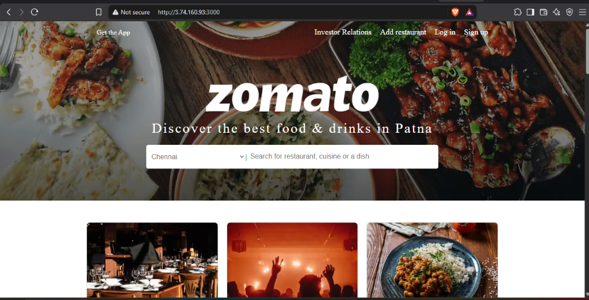
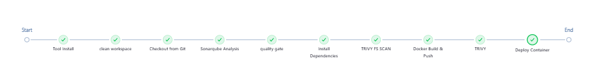
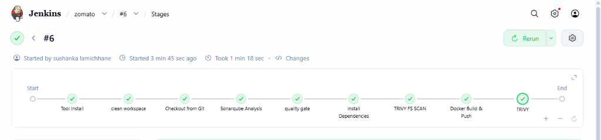
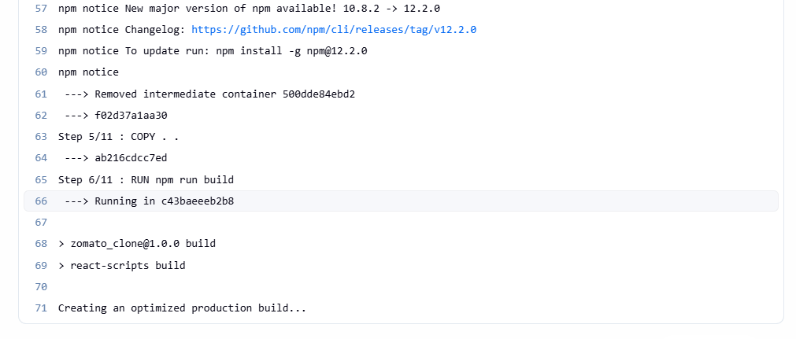

# 🍕 Zomato Clone — End-to-End DevSecOps CI/CD Pipeline

[](https://github.com/SUSHANK001-ops/zomato-clone-devops-project)
[](https://hub.docker.com/r/sushanka001/zomato)
[](https://nodejs.org/)
[](https://www.sonarqube.org/)
[](https://nginx.org/)

An enterprise-ready **DevSecOps CI/CD pipeline** designed to securely build, analyze, scan, containerize, and deploy a **Zomato Clone React Application** on AWS EC2 using modern DevOps and security tooling.

Inspired by [ProDevOpsGuy's Project Guide](https://blog.prodevopsguytech.com/zomato-clone-secure-deployment-with-devsecops-cicd), customized and enhanced with **Node.js 20 LTS**, **multi-stage Docker builds with Nginx**, and **Trivy vulnerability scanning**.

---

## 📸 Proof of Completion & Deployment []

### 1. Live Application Running on AWS EC2 (`:3000`)
The React application compiled into an optimized static bundle, served securely via Nginx Alpine on port `3000`:



### 2. Jenkins Complete CI/CD Pipeline (All Stages Passed)
Automated pipeline execution from code checkout to live container deployment:



### 3. Pipeline Stages Overview
Detailed breakdown of each automated stage in the Jenkins execution:



### 4. Docker Production Build & Optimization
Multi-stage build process executing `react-scripts build` inside a Node.js 20 container:



---

## 🏗️ Architecture & DevSecOps Workflow

```
[Developer Push] 
       │
       ▼
 [GitHub Repository]
       │ (Webhook / Trigger)
       ▼
 [Jenkins CI/CD Server]
       ├── 1. Clean Workspace
       ├── 2. Git Checkout
       ├── 3. SonarQube SAST & Quality Gate Analysis
       ├── 4. Dependency Installation (Node.js 20 LTS)
       ├── 5. Trivy FileSystem Vulnerability Scan
       ├── 6. Docker Build (Multi-stage Node 20 ➔ Nginx) & Tag
       ├── 7. Docker Push to Docker Hub Registry
       ├── 8. Trivy Docker Image Vulnerability Scan
       └── 9. Automated Container Deployment (Port 3000:80)
       │
       ▼
[Live Zomato App on EC2 (http://<EC2-IP>:3000)]
```

###  DevSecOps Toolchain
* **CI/CD Orchestration**: [Jenkins](https://www.jenkins.io/) (Declarative Pipeline)
* **Code Quality & SAST**: [SonarQube](https://www.sonarqube.org/) + SonarScanner CLI
* **Vulnerability Scanning**: [Aqua Security Trivy](https://trivy.dev/) (Filesystem & Container image scans)
* **Containerization**: [Docker](https://www.docker.com/) (Multi-stage build)
* **Web Server & Reverse Proxy**: [Nginx Alpine](https://nginx.org/)
* **Container Registry**: [Docker Hub](https://hub.docker.com/)
* **Runtime & Framework**: React 18, Node.js 20 LTS
* **Infrastructure**: AWS EC2 (Ubuntu 22.04 LTS)

> **💡 Security Architecture Note**:  
> Traditional OWASP Dependency-Check was deliberately replaced in this workflow with **Trivy FileSystem and Image Scanning**. Trivy delivers faster scan execution times, lower overhead on the Jenkins agent, and unifies application filesystem analysis and container CVE detection under a single scanner.

---

## 📜 Jenkins Pipeline Configuration (`Jenkinsfile`)

Below is the production `Jenkinsfile` used for this deployment, configured with **JDK 17**, **Node.js 20**, **SonarQube Quality Gate**, **Trivy**, and **Docker**:

```groovy
pipeline {
    agent any

    tools {
        jdk 'jdk17'
        nodejs 'node20'
    }

    environment {
        SCANNER_HOME = tool 'sonar-scanner'
    }

    stages {
        stage('clean workspace') {
            steps {
                cleanWs()
            }
        }

        stage('Checkout from Git') {
            steps {
                git branch: 'main', url: 'https://github.com/SUSHANK001-ops/zomato-clone-devops-project.git'
            }
        }

        stage("Sonarqube Analysis ") {
            steps {
                withSonarQubeEnv('sonar-server') {
                    sh ''' $SCANNER_HOME/bin/sonar-scanner -Dsonar.projectName=zomato \
                    -Dsonar.projectKey=zomato '''
                }
            }
        }

        stage("quality gate") {
            steps {
                script {
                    waitForQualityGate abortPipeline: false, credentialsId: 'Sonar-token' 
                }
            } 
        }

        stage('Install Dependencies') {
            steps {
                sh "npm install --legacy-peer-deps"
            }
        }

        stage('TRIVY FS SCAN') {
            steps {
                sh "trivy fs . > trivyfs.txt"
            }
        }

        stage("Docker Build & Push") {
            steps {
                script {
                    withDockerRegistry(credentialsId: 'docker', toolName: 'docker') {   
                        sh "docker build -t zomato ."
                        sh "docker tag zomato sushanka001/zomato:latest"
                        sh "docker push sushanka001/zomato:latest"
                    }
                }
            }
        }

        stage("TRIVY") {
            steps {
                sh "trivy image sushanka001/zomato:latest > trivy.txt" 
            }
        }

        stage("Deploy Container") {
            steps {
                sh '''
                    docker stop zomato || true
                    docker rm zomato || true
                    docker run -d --name zomato -p 3000:80 sushanka001/zomato:latest
                '''
            }
        }
    }
}
```

---

## 🐳 Dockerfile & Nginx Setup

### Multi-Stage `Dockerfile`
The build utilizes a multi-stage approach to ensure minimal image footprint and hardened production serving:

```dockerfile
# Stage 1: Build React App with Node.js 20 LTS
FROM node:20-alpine AS builder
WORKDIR /app
COPY package*.json ./
RUN npm install --legacy-peer-deps
COPY . .
RUN npm run build

# Stage 2: Serve with Nginx Alpine
FROM nginx:alpine
COPY nginx.conf /etc/nginx/conf.d/default.conf
COPY --from=builder /app/build /usr/share/nginx/html
EXPOSE 80
CMD ["nginx", "-g", "daemon off;"]
```

### Production `nginx.conf`
Configured with gzip compression, single-page application (SPA) routing, and static asset caching:

```nginx
server {
    listen 80;
    server_name localhost;

    root /usr/share/nginx/html;
    index index.html index.htm;

    gzip on;
    gzip_vary on;
    gzip_min_length 1024;
    gzip_types text/plain text/css text/javascript application/javascript application/json image/svg+xml;

    location / {
        try_files $uri $uri/ /index.html;
    }

    location ~* \.(?:ico|css|js|gif|jpe?g|png|woff2?|eot|ttf|svg|webp)$ {
        expires 1y;
        add_header Cache-Control "public, max-age=31536000, immutable";
    }

    location = /index.html {
        add_header Cache-Control "no-store, no-cache, must-revalidate";
        expires -1;
    }
}
```

---

## 🚀 How to Reproduce / Redo This Project

Follow these steps to replicate this entire deployment from scratch on your own AWS infrastructure.

### Step 1: Provision AWS EC2 Instance
* **AMI**: Ubuntu 22.04 LTS
* **Instance Type**: `t2.large` or `t3.large` (minimum 4GB+ RAM for Jenkins + SonarQube + Docker builds)
* **Storage**: 30 GB SSD (gp3)
* **Security Group Inbound Rules**:
  * `22`: SSH
  * `80`: HTTP
  * `3000`: Zomato Web Application
  * `8080`: Jenkins Dashboard
  * `9000`: SonarQube Server

---

### Step 2: Install Required Tools on EC2

#### 1. Java 17 & Jenkins
```bash
sudo apt update && sudo apt install -y fontconfig openjdk-17-jre openjdk-17-jdk
sudo wget -O /usr/share/keyrings/jenkins-keyring.asc https://pkg.jenkins.io/debian-stable/jenkins.io-2023.key
echo "deb [signed-by=/usr/share/keyrings/jenkins-keyring.asc] https://pkg.jenkins.io/debian-stable binary/" | sudo tee /etc/apt/sources.list.d/jenkins.list > /dev/null
sudo apt update && sudo apt install -y jenkins
sudo systemctl enable jenkins && sudo systemctl start jenkins
```

#### 2. Docker & Permissions
```bash
sudo apt install -y docker.io
sudo usermod -aG docker jenkins
sudo usermod -aG docker ubuntu
sudo systemctl restart docker
sudo systemctl restart jenkins
```

#### 3. SonarQube (via Docker)
```bash
docker run -d --name sonarqube -p 9000:9000 sonarqube:lts-community
```

#### 4. Trivy Security Scanner
```bash
sudo apt-get install wget apt-transport-https gnupg lsb-release -y
wget -qO - https://aquasecurity.github.io/trivy-repo/deb/public.key | sudo apt-key add -
echo deb https://aquasecurity.github.io/trivy-repo/deb $(lsb_release -sc) main | sudo tee -a /etc/apt/sources.list.d/trivy.list
sudo apt-get update && sudo apt-get install -y trivy
```

---

### Step 3: Jenkins Configuration & Plugins

1. Navigate to `http://<EC2-PUBLIC-IP>:8080` and unlock Jenkins.
2. Install the following plugins under **Manage Jenkins > Plugins**:
   * **NodeJS Plugin**
   * **SonarQube Scanner for Jenkins**
   * **Docker Pipeline** & **Docker**
   * **Eclipse Temurin installer** (or standard JDK)

3. Configure Tools under **Manage Jenkins > Tools**:
   * **JDK**: Name `jdk17` (Install Java 17)
   * **NodeJS**: Name `node20` (NodeJS version 20.x.x)
   * **SonarQube Scanner**: Name `sonar-scanner`
   * **Docker**: Name `docker`

---

### Step 4: Configure Credentials & Webhooks

1. **SonarQube Token**:
   * Go to SonarQube (`http://<EC2-PUBLIC-IP>:9000`) ➔ Administration ➔ Security ➔ Users ➔ Tokens ➔ Generate Token.
   * In Jenkins ➔ Manage Jenkins ➔ Credentials ➔ Add **Secret text**:
     * Secret: `<Your-SonarQube-Token>`
     * ID: `Sonar-token`
   * Add SonarQube Server under **Manage Jenkins > System > SonarQube servers**:
     * Name: `sonar-server`
     * Server URL: `http://<EC2-PUBLIC-IP>:9000`
     * Authentication token: `Sonar-token`

2. **SonarQube Quality Gate Webhook**:
   * In SonarQube ➔ Administration ➔ Configuration ➔ Webhooks ➔ Create:
     * Name: `jenkins-webhook`
     * URL: `http://<EC2-PUBLIC-IP>:8080/sonarqube-webhook/`

3. **Docker Hub Credentials**:
   * In Jenkins ➔ Credentials ➔ Add **Username with password**:
     * Username: `<your-dockerhub-username>`
     * Password: `<your-dockerhub-password-or-token>`
     * ID: `docker`

---

### Step 5: Run the Pipeline & Access the App

1. Create a new **Pipeline** job in Jenkins named `zomato-pipeline`.
2. Set Definition to **Pipeline script from SCM**, choose **Git**, and provide your repository URL.
3. Click **Build Now**.
4. Once completed, access the live application in your browser:
   ```
   http://<YOUR-EC2-PUBLIC-IP>:3000
   ```

---

## 🎯 Key Takeaways & Troubleshooting

* **Node.js 20 Compatibility**: React 18 and `@mui/material` build smoothly using `--legacy-peer-deps` during npm installation.
* **Trivy File & Image Scanning**: Provides comprehensive security visibility with scan reports saved as artifacts (`trivyfs.txt` and `trivy.txt`).
* **Container Isolation**: Uses custom `nginx.conf` mounted inside Nginx Alpine, ensuring lightning-fast load times and client-side route resolution.

---

## 👤 Author
**Sushanka Lamichhane**  
* GitHub: [@SUSHANK001-ops](https://github.com/SUSHANK001-ops)  
* Project Repo: [zomato-clone-devops-project](https://github.com/SUSHANK001-ops/zomato-clone-devops-project)
